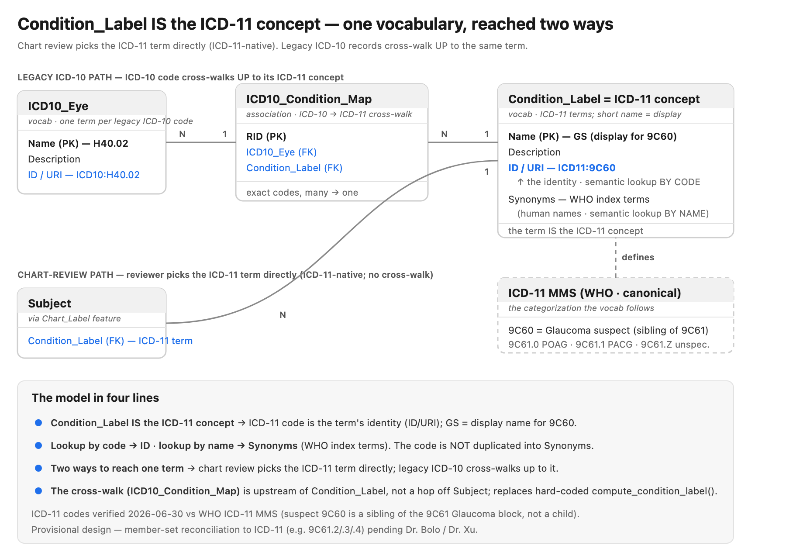

# Diagnosis & Severity Vocabularies — Clinical Data Dictionary

- Status: **draft / strawman** — clinical definitions are **provisional**, to be finalized with Dr. Bolo and Dr. Xu
- Date: 2026-06-30
- Catalog: `www.eye-ai.org`, catalog `eye-ai`, schema `eye-ai`
- Scope: clinical reference only — **this document does not modify the catalog** (see §8)

> **Provisional notice.** Every clinical definition, criterion, and threshold in
> this document is a placeholder strawman written to be *argued with*, not a
> settled standard. Nothing here is a clinical authority until reviewed and
> ratified by Dr. Bolo and Dr. Xu.
> Where a definition is unknown, it is marked **TBD — clinical**.

## 1. Purpose & scope

This document defines the **Condition (diagnosis)** and **Severity** vocabularies
used to label glaucoma in the Eye-AI catalog — their **clinical meaning** and
**intended use**, stated **independently of any algorithm, model, or grading
tool**. A term means what a clinician means by it; whether a CNN, an ICD-derived
rule, or a human grader produced a given label does not change the definition of
the label itself.

What this document is:

- The **clinical reference** for the members of `Condition_Label` and
  `Severity_Label` (and the related `Glaucoma_Diagnosis` image-level vocabulary).
- A **strawman conceptual model** for how *condition* and *severity* relate, to be
  refined in the upcoming meeting with Dr. Bolo and Dr. Xu.
- A **record of the problems** in the current vocabularies, grounded in the actual
  catalog data, so the cleanup is driven by evidence rather than opinion.

What this document is **not**:

- It is **not** an algorithm spec, a model card, or a grading protocol.
- It is **not** a numbered ADR — this is an **evolving clinical reference**, not a
  one-time decision record. Decisions that *result* from this work (e.g. renaming
  a term, removing a value) may be captured separately once made.
- It is **not** a mechanism for changing the catalog. Term/schema changes are
  requested through the `data-curation` process (see §8).

### Where this sits in the project (per the `eye-ai-platform` roadmap)

The `eye-ai-platform` repository is the project's front door and repository index.
Per its layering:

- **Schema and vocabulary *changes*** (adding/renaming terms, altering tables) are
  tracked and executed in **`data-curation`** — the catalog-integrity repo. Its
  *"Feature Registration Request"* issue template is the front door for requesting
  a catalog change.
- The **`eye-ai-ml`** library (the `EyeAI` domain class) **reads and writes** these
  vocabularies — e.g. `compute_condition_label()` / `insert_condition_label()` map
  ICD-10 codes into `Condition_Label` values.
- **This document** (in `eye-ai-platform/docs/design/`) is the **clinical reference
  for what the terms mean.** It informs the `data-curation` requests; it does not
  perform them.

## 2. Current state — every term, exactly as in the catalog

Snapshot taken 2026-06-30 from `www.eye-ai.org` / `eye-ai`. Descriptions and
synonyms are reproduced verbatim; commentary is set off as notes.

### 2.1 `Condition_Label` — 6 terms

> Catalog comment: *"Vocabulary of clinical condition labels used in chart-review
> diagnoses (e.g., glaucoma, diabetic retinopathy)."*

| RID | Name | Description (verbatim) | Synonyms (verbatim) |
|---|---|---|---|
| `2-NKSW` | **GS** | Glaucoma Suspect | `H40.00*`, `H40.01*`, `H40.02*`, `H40.03*`, `H40.04*`, `H40.05*`, `H40.06*` |
| `2-NKSY` | **POAG** | Primary open angle glaucoma | `H40.10*`, `H40.11*`, `H40.12*`, `H40.13*`, `H40.14*`, `H40.15*` |
| `2-NKT0` | **PACG** | Primary angle closure glaucoma | `H40.2*` |
| `2-NKT2` | **Other** | All other conditions (For ICD derived condition label) | — |
| `5-26KY` | **Normal or No dx** | No signs of glaucoma or No diagnosis made | — |
| `6-0A34` | **Unspecified Glaucoma** | Glaucoma present, subtype unspecified (from LAC patient-level chart review). | — |

> **Note — ICD codes in `Synonyms`.** The `Synonyms` field of `GS`, `POAG`, and
> `PACG` is currently being used to store **ICD-10 code patterns** (`H40.*`), not
> human-readable alternate names. This is the lookup key that
> `EyeAI.compute_condition_label()` reverses (its hard-coded `icd_mapping` mirrors
> exactly these patterns: `H40.0x → GS`, `H40.1x → POAG`, `H40.2* → PACG`, else
> `Other`). The codes belong in a defined ICD→condition mapping, not in a
> free-text synonyms list (see §6).

### 2.2 `Severity_Label` — 6 terms

> Catalog comment: *"Vocabulary of severity levels for clinical conditions (e.g.,
> mild, moderate, severe, advanced). Used in chart-review and ICD-derived severity
> classifications."*

| RID | Name | Description (verbatim) | Synonyms |
|---|---|---|---|
| `4-YFWT` | **Mild** | Mild stage | — |
| `4-YFWP` | **Moderate** | Moderate stage | — |
| `4-YFWR` | **Severe** | Severe stage | — |
| `4-YFWW` | **Unspecified/Indeterminate** | Indeterminate stage or stage unspecified | — |
| `4-YFWY` | **GS** | Glaucoma Suspect | — |
| `5-29BJ` | **Normal or No dx** | No signs of glaucoma or No diagnosis made | — |

> **Note.** Three of these six are not severity stages at all: `GS` and
> `Normal or No dx` are *conditions* (they duplicate `Condition_Label` members),
> and `Unspecified/Indeterminate` is a "no stage available" sentinel whose name
> packs a synonym into a slash. Only `Mild`/`Moderate`/`Severe` are genuine
> severity grades. See §3–§4 for the evidence and §6 for proposed fixes.

### 2.3 `Glaucoma_Diagnosis` — 3 terms (consolidated image-level vocabulary)

The image-level diagnostic vocabulary, **created 2026-06-30** as the single
consolidated vocabulary that the three diagnosis levels now share.

> Catalog comment: *"Vocabulary of image-level diagnostic categories for retinal
> images (e.g., referable glaucoma, no glaucoma)."*

| RID | Name | Description (verbatim) | Synonyms (verbatim) |
|---|---|---|---|
| `6-0EQR` | **No Glaucoma** | No Glaucoma | No Referable Glaucoma |
| `6-0EQP` | **Suspected Glaucoma** | Suspected Glaucoma | Referable Glaucoma |
| `6-0EQM` | **Unknown** | Unknown | Ungradable |

**Consumed by** (all foreign-key to `Glaucoma_Diagnosis.Name`, all populated):

| Table | Rows | Level |
|---|---|---|
| `Image_Diagnosis` | 194,204 | image-level (per fundus image) |
| `Observation_Diagnosis` | 7,020 | observation / visit-level |
| `Subject_Diagnosis` | 7,020 | subject-level |

All 194,204 `Image_Diagnosis` rows resolve to exactly these three terms —
**No Glaucoma** 155,279, **Suspected Glaucoma** 38,547, **Unknown** 378 (sum =
194,204) — confirming the 2026-06-30 consolidation is complete with no legacy
values or nulls remaining at the image level.

> **Is there a semantic difference between `Condition_Label` and
> `Glaucoma_Diagnosis`? Yes — they are deliberately different concepts, and the
> team has confirmed keeping them as two separate vocabularies.**
>
> - **`Condition_Label` = the clinical chart-review diagnosis** — the specific
>   glaucoma subtype (`POAG`, `PACG`, `GS`, `Normal or No dx`, `Unspecified
>   Glaucoma`, `Other`). **Fine-grained**; sourced from **clinical chart review /
>   ICD-coded encounters**; proposed to be **grounded in a curated glaucoma ICD
>   subset** with a real ICD-11 WHO URI identifier and ICD-10/ICD-11 code columns
>   (see §5.6).
> - **`Glaucoma_Diagnosis` = the image-level diagnostic category** (`No Glaucoma` /
>   `Suspected Glaucoma` / `Unknown`). **Coarse**, closer to **referability**;
>   produced by **graders or models on fundus images**; **not ICD-based**; stays a
>   **separate local vocabulary**.
>
> They differ on **granularity** (specific subtype vs. coarse category) and on
> **source** (chart review vs. image grading), so they are not merged.
> `Condition_Label` is the primary "condition" vocabulary; `Glaucoma_Diagnosis` is
> the image-level signal that can feed into it.

### 2.4 Supporting vocabularies (distinct from diagnosis — do not conflate)

These describe *provenance, status, and context* of a diagnosis, not the
diagnosis itself. Listed so the clinical reader knows they exist and why they are
**not** part of the condition/severity cleanup.

- **`Diagnosis_Tag`** (11 terms) — *provenance / study tags*, not diagnoses.
  Examples: `Initial Diagnosis` (from the original dataset), `CNN_Prediction`,
  `Expert_Consensus` (*"Expert consensus diagnosis from 3 expert graders (Benjamin
  Xu, Brandon Wong, Van Nguyen)"*), `Intragrader_Agreement`,
  `GlaucomaSuspect-Training` / `-Validation`, `UI Annotation`. Answers *"who/what
  produced this label, in what study?"*
- **`Diagnosis_Status`** (3 terms) — `Graded`, `Validated`, `Rejected`. Answers
  *"what is the review state of this diagnosis?"*
- **`ICD10_Eye`** — vocabulary of ICD-10 ophthalmic codes; the standardized source
  feeding the ICD-derived condition and severity labels.
- **`Grading_Condition`** — **exists but is currently empty (0 terms)**. Intended
  (per its catalog comment) to *"record the conditions under which a chart label
  was graded, so that the USC and LAC grading contexts remain distinguishable
  within the shared Chart_Label feature table."* Referenced by
  `Execution_Subject_Chart_Label.Grading_Condition`. Flagged here because it is a
  context axis the cleaned-up model may need to populate.

### 2.5 Proposed term definitions (strawman — current vs. proposed)

> **Provisional strawman for the Wednesday meeting.** These tables propose concrete
> descriptions and human-readable synonyms for every term, to sit beside the
> verified current state in §2.1–§2.2 (which is unchanged above). Clinical
> descriptions are drafted for discussion; any marked **(confirm clinically)** need
> Dr. Bolo / Dr. Xu sign-off. Severity staging *criteria* (thresholds) are
> deliberately left **TBD — clinical**.

**`Condition_Label` — proposed descriptions & synonyms** (grounding in ICD is §5.6):

| Term | Proposed description | Proposed synonyms (human-readable) |
|---|---|---|
| `GS` | Glaucoma suspect — findings suspicious for glaucoma (e.g. ocular hypertension / elevated IOP, suspicious optic disc, anatomical narrow angle) **without** established glaucomatous damage. *(confirm clinically)* | "Glaucoma Suspect" |
| `POAG` | Primary open-angle glaucoma — chronic glaucomatous optic neuropathy with an **open** anterior chamber angle and no secondary cause. *(confirm clinically)* | "Primary Open-Angle Glaucoma" |
| `PACG` | Primary angle-closure glaucoma — glaucoma associated with appositional/synechial **closure** of the anterior chamber angle. *(confirm clinically)* | "Primary Angle-Closure Glaucoma" |
| `Unspecified Glaucoma` | Glaucoma is present but the **subtype is not specified** (e.g. LAC patient-level chart review without a subtype). *(confirm clinically)* | "Glaucoma, unspecified"; "Glaucoma NOS" |
| `Normal or No dx` | **No glaucoma diagnosis** — no signs of glaucoma, or no diagnosis recorded. *(confirm whether to split "Normal/no disease" from "not assessed / no dx")* | "No Glaucoma"; "Normal" |
| `Other` | **Catch-all** for non-glaucoma conditions — used when the ICD-derived condition falls **outside** the curated glaucoma subset (§5.6). | "Non-glaucoma"; "Other condition" |

**`Severity_Label` — proposed descriptions & synonyms.** Applies **only to
established glaucoma** (§5.1–§5.2). `GS` and `Normal or No dx` are **proposed for
removal** from `Severity_Label` (they are conditions, not stages — see §4, §6.1).

| Term | Proposed action | Proposed description | Proposed synonyms |
|---|---|---|---|
| `Mild` | Keep | Mild-stage glaucomatous damage. **Criteria TBD — clinical** (e.g. VF MD threshold / RNFL / CDR). | "Early" |
| `Moderate` | Keep | Moderate-stage glaucomatous damage. **Criteria TBD — clinical**. | — |
| `Severe` | Keep | Severe / advanced-stage glaucomatous damage. **Criteria TBD — clinical**. | "Advanced" |
| `Unspecified/Indeterminate` → `Not Staged` (+ optional `Indeterminate`) | Split & rename | Separate *"glaucoma present, stage **not recorded**"* (`Not Staged`) from *"stage genuinely **indeterminate**"* (`Indeterminate`); removes the slash / embedded synonym. | "Stage unspecified" (Not Staged); "Indeterminate stage" (Indeterminate) |
| `GS` | **Remove from severity** | Not a stage — a condition; represent via `Condition_Label`. | — |
| `Normal or No dx` | **Remove from severity** | Not a stage — absence of disease; represent via `Condition_Label`. | — |

> **Note (informational).** The proposed stage set `Mild` / `Moderate` / `Severe` /
> `Indeterminate` mirrors the **ICD-10 7th-character glaucoma staging** convention
> (mild / moderate / severe / indeterminate stage), per the AAO guide (§8) — so the
> severity vocabulary aligns with how stage is already coded in the source data.
> The clinical *thresholds* defining each stage remain **TBD — Dr. Bolo / Dr. Xu**.

## 3. How the terms are actually used today (the evidence)

The clinical chart-review label lives in the **`Chart_Label` feature on Subject**
— table `Execution_Subject_Chart_Label`, **2,302 rows** — which carries
`Condition_Label` **and** `Severity_Label` as two columns on the same row. The
distinct `(Condition_Label, Severity_Label)` pairs actually present:

| Count | Condition_Label | Severity_Label |
|---:|---|---|
| 698 | GS | **GS** |
| 392 | POAG | Unspecified/Indeterminate |
| 287 | GS | Unspecified/Indeterminate |
| 219 | POAG | Moderate |
| 215 | POAG | Mild |
| 214 | POAG | Severe |
| 107 | Other | Unspecified/Indeterminate |
| 61 | Normal or No dx | Unspecified/Indeterminate |
| 27 | Normal or No dx | **Normal or No dx** |
| 21 | PACG | Unspecified/Indeterminate |
| 20 | PACG | Mild |
| 17 | PACG | Severe |
| 16 | Unspecified Glaucoma | Unspecified/Indeterminate |
| 8 | PACG | Moderate |

Read directly off the data:

- **The only rows carrying a genuine severity grade** (Mild/Moderate/Severe) are
  POAG (648 rows) and PACG (45 rows) — i.e. established glaucoma. Everything else
  is `Unspecified/Indeterminate` or a condition-as-severity sentinel.
- **698 rows are `GS` / `GS`** — the condition *and* the severity are both "GS".
  The severity column is restating the condition.
- **27 rows are `Normal or No dx` / `Normal or No dx`** — same pattern at the
  no-disease end.
- **`Unspecified/Indeterminate` is the catch-all** across every condition (≈900
  rows), used wherever no real stage applies.

## 4. Identified problems (what's broken and why)

1. **`Severity_Label` contains values that are really conditions, not stages.**
   `GS` (`4-YFWY`) and `Normal or No dx` (`5-29BJ`) duplicate `Condition_Label`
   members and make the severity column do double duty. The data proves it: 698
   `GS`/`GS` rows and 27 `Normal`/`Normal` rows where severity simply echoes
   condition.
2. **`Unspecified/Indeterminate` packs a synonym into the name via a slash.** It
   conflates two ideas ("indeterminate stage" vs "stage not recorded") in one
   label and functions as a dumping ground for any condition with no graded stage.
3. **Severity descriptions are circular and thin.** "Mild stage", "Moderate
   stage", "Severe stage" restate the name and carry **no clinical criteria** — no
   VF MD thresholds, no structural criteria, nothing a grader could apply
   reproducibly.
4. **Condition descriptions are better but lean on ICD codes stuffed in
   `Synonyms`.** The `H40.*` patterns in `GS`/`POAG`/`PACG` synonyms are a
   machine lookup key masquerading as alternate names; the clinical definition of
   each condition is mostly carried by the (short) Description, not a proper
   criteria statement.
5. **True severity only meaningfully applies to established glaucoma
   (POAG/PACG).** Grading a "suspect" or a "normal" eye on a Mild/Moderate/Severe
   scale is a category error — which is exactly why those rows fall back to
   condition-as-severity or `Unspecified`.

## 5. Proposed conceptual model (the strawman to discuss)

> **Provisional.** This section is the strawman to be confirmed/revised with
> Dr. Bolo and Dr. Xu.

### 5.1 Two separate axes

- **Condition** = *which glaucoma, or none* — the diagnosis. Candidate members
  (from current `Condition_Label`): `Normal or No dx`, `GS` (glaucoma suspect),
  `POAG`, `PACG`, `Unspecified Glaucoma`, `Other`.
- **Severity** = *stage of established glaucomatous disease* —
  `Mild` / `Moderate` / `Severe` — **applicable only when a glaucomatous condition
  is present**. The non-stage values (`GS`, `Normal or No dx`) move **out** of
  severity; the "no stage available" case is represented explicitly (see §6),
  not by smuggling a condition into the severity column.

### 5.2 Intended relationship: separate but conditional

Severity is a **further attribute of an established glaucoma diagnosis**, not an
independent label. You first have a *condition*; *severity* refines it **only**
when that condition is glaucoma (POAG/PACG, and possibly `Unspecified Glaucoma`).

This directly answers **Professor Carl's question** — *"is there such a thing as 'mild
glaucoma', or is it glaucoma + a separate severity attribute?"* — with a proposed
answer: **separate but conditional.** "Mild glaucoma" = condition `POAG` (or
`PACG`) + severity `Mild`; severity is not baked into the condition term.
**Pending clinical confirmation.**

Corollaries to confirm in the meeting:

- A **suspect (`GS`)** has, by definition, no established disease to stage — so
  does a suspect have a severity at all? (Strawman: **no** — severity is
  undefined/not-applicable for `GS`.)
- A **normal** eye has no severity. (Strawman: not-applicable.)

### 5.3 Data-model placement

**Current join (as built):**

- `Condition_Label` and `Severity_Label` are **two independent foreign-key columns
  side by side** on the `Chart_Label` feature on Subject
  (`Execution_Subject_Chart_Label`: `Condition_Label` → `Condition_Label.Name`,
  `Severity_Label` → `Severity_Label.Name`). Nothing in the schema ties the two —
  any condition can pair with any severity, which is how `GS`/`GS` and
  `Normal`/`Normal` arose.
- **Severity also stands alone**, decoupled from the chart condition, in the
  **ICD-derived feature** `Execution_Clinical_Records_Glaucoma_Severity`
  (**3,674 rows**; column `ICD_Severity_Label` → `Severity_Label.Name`), whose
  target `Clinical_Records` carries the condition separately in
  `Clinical_Records.ICD_Condition_Label` → `Condition_Label.Name`.

**Future enforcement (to discuss).** Once severity is defined as conditional on a
glaucoma condition, the schema *could* enforce "severity requires a glaucoma
condition" — e.g. severity is non-null only for glaucomatous conditions and
null/not-applicable otherwise, or a constraint/validation at write time in the
`Chart_Label` and `Glaucoma_Severity` features. This is a `data-curation` change,
out of scope for this document beyond recording the intent.

### 5.4 Define terms clinically, not by how the label was produced

A term's definition must describe **the eye**, never the mechanism that assigned
the label. The same term is written into the catalog two ways — by a **human**
chart reviewer, and by an automated **ICD rule** (see §5.6 for how both reach the
same term) — and its meaning must be identical in both cases.

So: define `POAG` as a clinical condition, **not** as "whatever `H40.1x` maps to"
(only true for the ICD path) or "what the grader circled" (only true for the
human path). "Moderate POAG" must mean the same clinical thing whether a grader
wrote it or an ICD rule produced it.

### 5.5 Do not conflate the two senses of "severity"

There are **two unrelated meanings of "severity"** in this codebase; the
vocabulary concerns only the first:

- **Severity grade (this document)** — `Severity_Label`: the clinical stage of
  disease (Mild/Moderate/Severe).
- **Laterality severity (different concept)** — `EyeAI.severity_analysis()` in the
  `eye-ai-ml` library computes *which eye is worse* (left vs right) from RNFL
  thickness, HVF MD, and CDR, and flags `Severity_Mismatch`. This is **not** the
  `Severity_Label` vocabulary and must never be confused with it.

The doc states this explicitly so the two are never merged in code or
conversation.

### 5.6 Grounding `Condition_Label` in a curated glaucoma ICD subset (ICD-10 + ICD-11 + WHO URI)

> **Settled design direction** (provisional only on the clinical *wording*). This is
> the core proposal for how `Condition_Label` is grounded in an external standard.

**Curated subset, at the category level — not the full ICD set.** Ground
`Condition_Label` in a curated subset of **only the glaucoma codes**, at the
**category level** (`H40.0` / `H40.1` / `H40.2`) — **not** the granular
per-eye / per-stage sub-codes. Working at the category level keeps the
ICD-10 ↔ ICD-11 crosswalk effectively **1-to-1 and lossless**: we map the coarse
condition categories, not the laterality/stage detail. *Rationale (Carl):* a small
curated subset keeps the vocabulary tables small and the crosswalk easy to maintain
and audit. (For scale: the live data holds ~27,962 ICD-coded rows / 1,209 distinct
codes, of which only the ~134 H40 glaucoma codes — and at category level only
H40.0/.1/.2 — matter for this vocabulary; see §3.)

**Documented ICD-10 ↔ ICD-11 mapping.** Because the curated set is small, the full
mapping is documented inline:

| `Condition_Label` | ICD-10-CM category | ICD-11 (MMS) code | ICD-11 title | Crosswalk |
|---|---|---|---|---|
| `GS` (Glaucoma Suspect) | `H40.0` (H40.00–H40.06) | **`9C60`** | Glaucoma suspect | Concept-equivalent but **structurally relocated** — ICD-11 breaks "glaucoma suspect" out as its **own stem code `9C60`**, a sibling of `9C61` Glaucoma (in ICD-10 it sits *inside* the H40 block). 1-to-1 at our category granularity; note a few H40.0 sub-codes move under `9C61` in ICD-11 (e.g. ocular hypertension → `9C61.01`; primary angle-closure suspect → `9C61.10`). |
| `POAG` | `H40.1` (H40.10–H40.15) | **`9C61.0`** | Primary open-angle glaucoma | Equivalent, 1-to-1 |
| `PACG` | `H40.2` | **`9C61.1`** | Primary angle closure or angle closure glaucoma | Equivalent, 1-to-1 |
| `Unspecified Glaucoma` | `H40.9` (unspecified glaucoma) | **`9C61.Z`** | Glaucoma, unspecified | Equivalent |
| `Normal or No dx` | — (no glaucoma code) | — | — | Absence of disease — no glaucoma code |
| `Other` | — (non-glaucoma; default) | — | — | Catch-all for ICD codes outside the curated glaucoma subset |

WHO crosswalk types (equivalent / broader / narrower / approximate) are noted where
relevant; at this **coarse category level** the curated mapping is effectively
**1-to-1 and lossless** for `POAG` / `PACG` / `Unspecified Glaucoma`, with the
single caveat on `GS` above (concept-equivalent, structurally relocated in ICD-11).

**Dual ICD-10 + ICD-11 code columns.** Augment the vocabulary so each curated term
carries **both**:

- an **ICD-10-CM code** column (the `H40.*` category code) — this matches the data
  we actually have, which is **natively ICD-10-CM** (~27,962 stored codes) and
  which incoming US EHR data keeps arriving as; and
- an **ICD-11 code** column (the `9C60` / `9C61.x` category code).

**Real ICD-11 WHO URI in the identifier column.** The term's **identifier column**
(the vocabulary's `ID` / `URI`) holds the **real, authoritative ICD-11 WHO URI**
(`http://id.who.int/icd/...`) as the external reference for the term — rather than
a locally-minted id. *Why ICD-11 for the URI:* ICD-11 is **published by WHO as
linked data with official, canonical entity URIs**, so authoritative identifiers
come "for free"; **ICD-10-CM has no single official URI scheme** (it is maintained
by CDC/NCHS as code lists — URIs exist only via third parties like BioPortal or
must be self-minted). So the **URI is ICD-11** (authoritative, and forward-looking
since international data will be ICD-11-encoded), while the **ICD-10 code is
retained in its own column** for the data we actually hold. This uses the Deriva
vocabulary mechanism where a term's `URI` references an externally-defined term.

> **ICD-11 URI — implementation detail to confirm before catalog work.** The WHO
> URI **scheme** is settled — `http://id.who.int/icd/release/11/{version}/mms/{code}`
> (MMS linearization) or `http://id.who.int/icd/entity/{id}` (foundation). The
> **exact per-term IRIs / entity-ids must be confirmed against the WHO ICD-11 API /
> browser** (`icd.who.int`) before implementation; they are **not** minted in this
> doc. **Confirmed ICD-11 codes & titles** (WHO ICD-11 MMS): `9C60` Glaucoma
> suspect · `9C61` Glaucoma (parent) · `9C61.0` Primary open-angle glaucoma ·
> `9C61.1` Primary angle closure / angle closure glaucoma · `9C61.Z` Glaucoma,
> unspecified. *(`9C61.01` Ocular hypertension and `9C61.10` Primary angle-closure
> suspect are noted for the GS caveat.)*

**Consequence — `Synonyms` becomes human-only.** Once the codes live in their
dedicated ICD-10 / ICD-11 columns and the URI in the identifier, the `Synonyms`
field holds **human-readable alternate names only** (e.g. "Primary Open-Angle
Glaucoma"). The `H40.*` patterns currently mis-stored in `Condition_Label.Synonyms`
(see §2.1) move out into the proper code columns / mapping.

**Primary clinical reference:** the **AAO Glaucoma ICD-10 Quick Reference Guide**
is the authoritative ophthalmology coding reference for the H40 glaucoma codes (full
citation in §8).

#### 5.6.1 The term *is* the ICD-11 concept (reading of the grounding above)

The grounding above has a clean conceptual reading: each `Condition_Label` term
**is** an ICD-11 concept, with the short name (`GS`) as its display label —
`GS` = ICD-11 `9C60`, `POAG` = `9C61.0`, `PACG` = `9C61.1`. So there is **one
vocabulary (ICD-11 concepts) reached two ways**, not two kinds of label sharing a
vocabulary:

- **Human chart review** picks the ICD-11 concept **directly** — ICD-11-native,
  *not* ICD-free (the reviewer already chooses in ICD-11 terms, displayed as
  `GS`/`POAG`/…).
- **Legacy ICD-10 records** carry an ICD-10 code and are **translated up to the
  ICD-11 concept**.

Both arrive at the **same** ICD-11 term. ICD-11 is the term's identity (in the
`ID`/`URI` / code columns above); ICD-10 never stands alone as the identity.

> **Open design decision — where do the ICD-10 codes live?** Two mechanisms are
> on the table and should be resolved in the `data-curation` request:
> **(a)** dual **ICD-10 + ICD-11 code columns on each `Condition_Label` term**, at
> **category level** (`H40.0/.1/.2`), per the grounding proposal above — simplest,
> keeps everything on the term, lossless *because* it stays coarse; or
> **(b)** a separate **`ICD10_Condition_Map` cross-walk table** at **exact-code
> level** (§5.6.2) — needed if we ever map the granular per-code data (e.g. to
> drive `compute_condition_label` off catalog data). (a) and (b) are not
> exclusive: the category-level columns can be the human-facing grounding while
> the exact-code table drives computation. The rest of this section describes (b)
> and what it buys.

#### 5.6.2 Mechanism — the ICD-10→ICD-11 cross-walk table and the compute join

**Two/three vocabularies + one cross-walk.**

| Object | Role | Code |
|---|---|---|
| `Condition_Label` | **the ICD-11 concept** (display name `GS`, `POAG`, …) | `ID`/`URI` = its **ICD-11** code (the identity) |
| `ICD10_Eye` | one term per legacy ICD-10 code (`H40.00`…) | `ID`/`URI` = that ICD-10 code |
| `ICD10_Condition_Map` *(new, association)* | **ICD-10 → ICD-11 cross-walk** | two FKs: `ICD10_Eye` → `Condition_Label` |

```
human chart review ───────────────▶ Condition_Label (= ICD-11 concept; GS = 9C60)
                                            ▲
ICD10_Eye(H40.02) ──(ICD-10→ICD-11)─────────┘
```



*Figure 1 — ERD for the ICD-11 coding model. Source:
[`img/icd11-condition-erd.svg`](img/icd11-condition-erd.svg) (PNG regenerated from it).*

The ICD-11 codes (`GS=9C60`, `POAG=9C61.0`, `PACG=9C61.1`,
`Unspecified Glaucoma=9C61.Z`) and their ICD-10↔ICD-11 crosswalk are in the
mapping table in §5.6 above. Note that glaucoma suspect `9C60` is a **sibling
stem code of** the `9C61` Glaucoma block (not a child), which **reinforces §5.2**:
a suspect is not staged disease. The secondary/developmental subtypes
(`9C61.2` secondary OAG, `9C61.3` secondary ACG, `9C61.4` developmental)
currently have no dedicated `Condition_Label` member (they fall into `Other` —
see §6.2, §7).

**Why a cross-walk *table* (mechanism (b)), not more `ID`/`Synonyms` columns.**
For the exact-code mechanism, the ICD-10
side is *many* codes per concept (`H40.00`–`H40.06` all → `GS`) — a many-to-one
relation. A single-valued `ID`/`URI` cannot hold a family, and `Synonyms` is for
human names, not codes (see the lookup rule below). Only an association table
fits. Map **exact codes** (FKs to real `ICD10_Eye` terms), not wildcard patterns
(`H40.0*`), so no wildcard-matching logic returns.

**What this retires in `eye-ai-ml` (verified against `eye_ai/eye_ai.py`,
2026-06-30).** The cross-walk table makes the **hard-coded ICD→condition mapping
obsolete.** `EyeAI.compute_condition_label()` (`eye_ai/eye_ai.py:268`) today does
two things:

1. **ICD-10 → condition mapping** via an inline `icd_mapping` dict
   (`H40.0x → GS`, `H40.1x → POAG`, `H40.2* → PACG`, else `Other`) applied by a
   `startswith` prefix match. **This is exactly what the cross-walk table
   replaces** — the dict is a copy of the mapping that will now live as catalog
   data, so it should be deleted and the mapping read from `ICD10_Condition_Map`
   instead. (It is the *only* copy of this mapping in the library — one
   definition site, `eye_ai.py`, plus its unit test `test_eye_ai_units.py:139`;
   no hidden duplicates.)
2. **Multi-code priority resolution** — when one `Clinical_Records` has several
   ICD codes, it keeps the highest-priority condition (`PACG > POAG > GS >
   Other`) via a priority sort + `drop_duplicates`. **This is *not* mapping and
   is *not* replaced by the table** — it is a per-record reconciliation policy
   that still needs a home (in the library, or as a documented rule the cross-walk
   consumer applies).

So the accurate statement: the **`icd_mapping` dict is no longer needed** (catalog
data supersedes it), and once it's gone the function is reduced to the
priority-resolution step over rows already carrying a `Condition_Label` from the
table — or removed entirely if that resolution moves elsewhere.
`insert_condition_label()` (`eye_ai.py:302`, writes the result into
`Clinical_Records`) is unaffected. **Retiring the dict is an `eye-ai-ml` code
change**, tracked there, contingent on `ICD10_Condition_Map` existing first; this
document only records that the mapping's authoritative home moves from code to
catalog.

**The function's input is already a catalog bridge — so the whole thing becomes a
join.** `compute_condition_label()` takes a DataFrame with columns
`RID, Clinical_Records, ICD10_Eye` — one row per (clinical record, ICD-10 code)
— i.e. a read of a **`Clinical_Records ⇄ ICD10_Eye` association table** already
in the catalog (verified from the function body `eye_ai.py:293` and the test
fixture `test_eye_ai_units.py:131`; both endpoints are confirmed catalog objects
— `Clinical_Records` table, `ICD10_Eye` vocabulary §2.4). That means **two
distinct bridge tables** are involved, and together they represent *all* the
codes as data, with no Python mapping left:

| Bridge | Relates | Answers | Kind | Status |
|---|---|---|---|---|
| `Clinical_Records ⇄ ICD10_Eye` | a record ↔ the ICD-10 codes it carries | "which codes does *this record* have?" | **observed data** | exists (the function's input) |
| `ICD10_Condition_Map` (`ICD10_Eye ⇄ Condition_Label`) | an ICD-10 code ↔ its ICD-11 concept | "which condition does *this code* mean?" | **classification rule** | proposed (§5.6) |

With both in place, the mapping step is purely a join —
`Clinical_Records ─(data bridge)─ ICD10_Eye ─(ICD10_Condition_Map)─
Condition_Label` — and the inline dict disappears entirely. Keep the two bridges
distinct: the first records *facts* (this patient's codes), the second records
the *rule* (what a code means); they change on different schedules and for
different reasons.

**End-to-end: many ICD-10 codes → one ICD-11 `Condition_Label`.** A
`Clinical_Records` typically carries **several** ICD-10 codes. The resolution is:

1. **Map every code to its ICD-11 concept** via the join (not "pick one code").
   E.g. a record with `H40.11` and `H40.00` yields candidates
   {`POAG`=`9C61.0`, `GS`=`9C60`}.
2. **Pick the highest-priority concept** by clinical severity ordering
   `PACG > POAG > GS > Other` (`eye_ai.py:295`). Here POAG outranks GS → the
   record's `Condition_Label` = **`POAG` (ICD-11 `9C61.0`)**.

So under the new structure the stored label **is an ICD-11 concept** — the ICD-10
codes are the input, the winning ICD-11 term is the output. Two notes: the
priority tie-break now orders **ICD-11 concepts** (a clinical ordering of
conditions, which is where it belongs, and could itself become a priority column
on `Condition_Label`); and if the secondary/developmental concepts
(`9C61.2/.3/.4`, currently → `Other`) become members, they must be slotted into
that ordering — a clinical decision (§7).

> **Unverified:** the exact name of the `Clinical_Records ⇄ ICD10_Eye`
> association table is not confirmed — the notebook that builds the input
> DataFrame is not in-repo, and the deriva MCP surface was not connected to
> inspect the schema. Its *existence* is strongly implied by the column shape and
> confirmed endpoints; the table name is a TODO for catalog verification.

**Granularity — `Condition_Label` follows ICD-11's categories (chosen).**
Because the term *is* the ICD-11 concept, the vocabulary's granularity is
ICD-11's: each `Condition_Label` term corresponds to one ICD-11 concept
(`GS=9C60`, `POAG=9C61.0`, `PACG=9C61.1`, `Unspecified Glaucoma=9C61.Z`). This is
the strong form (formerly framed as "Option B") — ICD-11's taxonomy *drives* the
vocabulary, it does not merely tag a parallel local scheme. Consequence: ICD-10's
finer suspect distinctions (`H40.00`–`H40.06`) **collapse** into the single
ICD-11 suspect concept `9C60` when translated up — which is correct, because
ICD-11 itself collapses them. Where ICD-11 and our current member set differ
(e.g. the `9C61.2/.3/.4` secondary/developmental subtypes have no current
`Condition_Label` member), the member set should be reconciled to ICD-11 — a
clinical decision for Dr. Bolo / Dr. Xu (see §7).

**Placement vs. the Subject (do not mis-wire).** The cross-walk is **upstream of**
`Condition_Label`, not a hop off the Subject. Both label sources reference the
**same ICD-11 term**; the difference is only how they *reach* it:

- **Chart-review path** (`Execution_Subject_Chart_Label`) references the ICD-11
  `Condition_Label` term **directly** — the reviewer chose it. No ICD-10, no
  cross-walk (the choice is *already* ICD-11; "no ICD" would be wrong — it is
  ICD-11-native).
- **Legacy ICD-10 path** (`Clinical_Records`, ICD-derived) carries an ICD-10
  code and reaches the ICD-11 term **through the cross-walk**.

Every consumer points at the ICD-11 term; the cross-walk only translates legacy
ICD-10 up to it.

**Lookup by code — use `ID`/`URI`, the code is the row's identity (not a
synonym).** Each ICD-11 term's code IS that term's `ID`/`URI`, so
`lookup_by_id("ICD11:9C60") → the term` is a typed, indexed, one-hop lookup —
this *is* semantic lookup by code, and it needs **no** duplication of the code
into `Synonyms`. The term's `Synonyms` hold the **WHO index/subcategory terms**
(human-readable: "borderline glaucoma", "ocular hypertension", "narrow angle
glaucoma suspect", …), which give semantic lookup *by name*. Putting the code
itself into its own row's `Synonyms` would merely duplicate `ID` and reintroduce
the "is this string a code or a name?" ambiguity. (A code only ever belongs in
`Synonyms` as a *secondary/deprecated alias code* for the same concept; the
primary code is always `ID`.) Net: lookup by code → `ID`; lookup by name →
`Synonyms`; one `resolve(token)` view can offer both behind a single call.

> **Status of the codes.** The ICD-11 codes here were **verified 2026-06-30**
> against the WHO ICD-11 MMS (glaucoma suspect = `9C60`; `9C61.*` for established
> glaucoma — see the code-numbers table above). Two items still need
> confirmation before the `data-curation` request relies on them: (1) the
> condition→code map for the `9C61.2/.3/.4` secondary/developmental subtypes,
> which have no dedicated `Condition_Label` member yet (clinical — Dr. Bolo /
> Dr. Xu); and (2) that `ICD10_Eye` is structurally a controlled-vocabulary
> table (asserted from §2.4, not yet verified against the live catalog — the
> deriva MCP surface was not connected when this was written).

## 6. Naming cleanup proposals

> **Provisional.** Names and descriptions below are placeholders for discussion;
> clinical criteria are **TBD — clinical**, pending Dr. Bolo and Dr. Xu.

### 6.1 `Severity_Label`

| Current term | Proposed action | Proposed name | Proposed description (placeholder) |
|---|---|---|---|
| `Mild` (`4-YFWT`) | **Keep**, add real criteria | `Mild` | *Mild-stage glaucomatous damage.* **TBD — clinical** (VF MD threshold / structural criteria). |
| `Moderate` (`4-YFWP`) | **Keep**, add real criteria | `Moderate` | *Moderate-stage glaucomatous damage.* **TBD — clinical**. |
| `Severe` (`4-YFWR`) | **Keep**, add real criteria | `Severe` | *Severe / advanced-stage glaucomatous damage.* **TBD — clinical**. |
| `Unspecified/Indeterminate` (`4-YFWW`) | **Split & rename** | `Not Staged` (and possibly a separate `Indeterminate`) | Distinguish *"glaucoma present, stage not recorded"* from *"stage genuinely indeterminate."* Remove the slash. |
| `GS` (`4-YFWY`) | **Retire from severity** | — | `GS` is a condition, not a stage; represent via `Condition_Label`. Migrate existing 698+287 rows (see migration note). |
| `Normal or No dx` (`5-29BJ`) | **Retire from severity** | — | A condition / absence of disease, not a stage; represent via `Condition_Label`. Migrate existing rows. |

> **Migration note (for `data-curation`, not this doc):** retiring severity `GS`
> and `Normal or No dx` requires re-mapping the existing `Chart_Label` rows
> (698 `GS`/`GS`, 287 `GS`/`Unspecified`, 61+27 Normal rows) so the condition is
> preserved and severity becomes not-applicable/not-staged. Counts in §3.

### 6.2 `Condition_Label`

| Current term | Proposed action | Note |
|---|---|---|
| `GS`, `POAG`, `PACG` | Keep names as display labels; **add proper clinical definitions** and **ground in the curated glaucoma ICD subset** (§5.6) | Each term **is its ICD-11 concept** (`GS=9C60`, `POAG=9C61.0`, `PACG=9C61.1`), with the real **ICD-11 WHO URI** in the identifier. Move the `H40.*` patterns **out of `Synonyms`** into dedicated ICD-10/ICD-11 code columns (grounding) and/or the `ICD10_Eye → Condition_Label` cross-walk (§5.6, mechanism (b) — the relation `compute_condition_label()` hard-codes). `Synonyms` then holds human names / WHO index terms only (lookup by name); the code is the identifier (lookup by code). |
| `Normal or No dx` | Consider clearer split | "Normal" (no disease) vs "No dx" (not assessed) may warrant separation — **TBD — clinical**. |
| `Unspecified Glaucoma` | Keep | Glaucoma present, subtype unspecified (LAC patient-level). Confirm it is eligible for severity grading. |
| `Other` | Keep — but reconcile scope | Currently the catch-all for non-glaucoma ICD-derived conditions. Note the tension: §5.6 tentatively routes ICD-11 `9C61.2/.3/.4` (secondary / developmental **glaucoma**) here for lack of a dedicated member — so `Other` would hold some glaucoma. Decide whether to add secondary/developmental members instead (clinical — §7). |

**Worked example — a `Condition_Label` row under the §5.6 model.** The term *is*
the ICD-11 concept: `Name` is the display label, the code is the row's **`ID`**
(semantic lookup *by code*), and `Synonyms` carry the WHO index terms (semantic
lookup *by name*). Below is the full `GS` (glaucoma suspect) row; the clinical
*definition* is still provisional, but the ICD-11 code was verified 2026-06-30.

| Column | Value |
|---|---|
| `RID` | `2-NKSW` *(system-assigned — the existing GS row from §2.1)* |
| `Name` | `GS` |
| `Description` | Glaucoma suspect — an eye with one or more risk factors for glaucoma (elevated IOP / ocular hypertension, suspicious optic disc or RNFL, narrow/occludable angle, or steroid response) **without** definite glaucomatous optic neuropathy or visual-field loss. **TBD — clinical** (Dr. Bolo / Dr. Xu). |
| `Synonyms` | `Glaucoma Suspect`, `Suspected glaucoma`, `Borderline glaucoma`, `Ocular hypertension`, `Primary open-angle glaucoma suspect`, `Normal pressure glaucoma suspect`, `Narrow angle glaucoma suspect` *(WHO `9C60` index terms — human names, not codes)* |
| `ID` | `ICD11:9C60` *(the identity — this is the by-code lookup key; verified 2026-06-30)* |
| `URI` | `http://id.who.int/icd/release/11/mms/9C60` |

The same pattern for the established-glaucoma siblings (`ID`/`URI` differ, all
else analogous):

| `Name` | `ID` | `URI` |
|---|---|---|
| `POAG` | `ICD11:9C61.0` | `http://id.who.int/icd/release/11/mms/9C61.0` |
| `PACG` | `ICD11:9C61.1` | `http://id.who.int/icd/release/11/mms/9C61.1` |
| `Unspecified Glaucoma` | `ICD11:9C61.Z` | `http://id.who.int/icd/release/11/mms/9C61.Z` |

ICD-10 equivalents are **not** in these rows — they are rows in
`ICD10_Condition_Map` pointing at the term. For `GS`: `H40.00`–`H40.06` (the
family currently mis-stored as `H40.0*` patterns in `Synonyms`; ICD-10 `H40.0` =
"glaucoma suspect", `.00`–`.06` by mechanism).

> The `Synonyms` list is **illustrative** — copy the authoritative WHO `9C60`
> index terms from https://icd.who.int/browse11 when finalizing. And `ID`/`URI`
> are assumed to be columns of the Deriva vocabulary table (standard for Deriva
> controlled vocabularies, but not yet verified against this catalog — see the
> §5.6 status box).

### 6.3 Severity naming precision

Per Dr. Xu's caution (§7), `Mild/Moderate/Severe` may be ambiguous without a named
basis. Options to decide in the meeting: a neutral name vs. a basis-qualified name
(e.g. `HPA_severity` vs `CMS_severity`). The vocabulary name should make the
**basis of staging unambiguous** so two different staging systems are never
silently mixed in one column.

### 6.4 New term needed for the GAMMA mapping

Dr. Kyle's **GAMMA** mapping will require a severity term **"Moderate-to-Severe"**
(per Dr. Bolo's mapping, GAMMA's **"Progressive"** category maps to a
**Moderate-to-Severe** severity band, which needs to be added to the
vocabulary). Open question for the
meeting: does a `Moderate-to-Severe` band fit the cleaned-up Mild/Moderate/Severe
scheme as an additional member, or should cross-dataset band collapses
(GAMMA/GLEAM) be handled as a **mapping layer** on top of canonical
Mild/Moderate/Severe rather than as new vocabulary terms? Flagged so the cleanup
doesn't lock GAMMA/GLEAM out.

## 7. Open clinical questions for Dr. Bolo & Dr. Xu (for the meeting)

1. **Severity criteria.** What clinical criteria define `Mild` / `Moderate` /
   `Severe`? HPA (Hodapp-Parrish-Anderson) staging? VF MD thresholds? Structural
   (RNFL/CDR) criteria, or a combination? (Dr. Bolo.)
2. **Separate but conditional?** Confirm severity should be a separate attribute
   that applies **only** when an established glaucoma condition is present
   (Professor Carl's question; strawman in §5.2).
3. **Naming basis.** How to name severity so its meaning is unambiguous — neutral
   name vs. basis-qualified (`HPA_severity` vs `CMS_severity` vs a neutral label)
   — per Dr. Xu's caution about silently mixing staging systems.
4. **Remove non-stage values?** Confirm retiring `GS` and `Normal or No dx` from
   `Severity_Label` (they are conditions, not stages).
5. **Suspects and severity.** Does a glaucoma suspect (`GS`) have a severity at
   all? (Strawman: no — not applicable.)
6. **GLEAM / GAMMA.** What, if anything, must the cleaned-up vocabulary provide so
   the GLEAM and GAMMA mappings land cleanly — notably GAMMA's `Moderate-to-Severe`
   band (§6.4) — without distorting the canonical clinical definitions?

## 8. References / provenance

- This document consolidates the read-only investigation from the 2026-06-30
  review of the diagnosis/condition/severity landscape.
- **Catalog objects referenced** (schema `eye-ai`): vocabularies `Condition_Label`,
  `Severity_Label`, `Glaucoma_Diagnosis`, `Diagnosis_Tag`, `Diagnosis_Status`,
  `ICD10_Eye`, `Grading_Condition`; feature/association tables
  `Execution_Subject_Chart_Label` (Chart_Label feature on Subject),
  `Execution_Clinical_Records_Glaucoma_Severity` (Glaucoma_Severity feature on
  Clinical_Records), `Clinical_Records`, `Image_Diagnosis`, `Observation_Diagnosis`,
  `Subject_Diagnosis`.
- **Proposed new object (not yet in catalog)**: `ICD10_Condition_Map` — an
  association table that **cross-walks legacy ICD-10 → the ICD-11 concept**
  (`ICD10_Eye → Condition_Label`, §5.6), the data-driven replacement for the
  hard-coded `icd_mapping` in `compute_condition_label()`. Name is a placeholder;
  creation is a `data-curation` change.
- **Library code referenced** (`eye-ai-ml/eye_ai/eye_ai.py`):
  `compute_condition_label()`, `insert_condition_label()`, `severity_analysis()`
  (laterality — see §5.5).
- **Roadmap context:** repository layering per `eye-ai-usc/eye-ai-platform`
  (front door / repository index).
- **Clinical & coding references** (for the `Condition_Label` ICD grounding, §5.6):
  - AAO *Glaucoma ICD-10 Quick Reference Guide* — **primary** clinical reference
    for the H40 glaucoma codes:
    <https://www.aao.org/Assets/5adb14a6-7e5d-42ea-af51-3db772c4b0c2/636713219263270000/bc-2568-update-icd-10-quick-reference-guides-glaucoma-final-v2-color-pdf?inline=1>
  - icd10data.com — ICD-10-CM H40 glaucoma codes:
    <https://www.icd10data.com/ICD10CM/Codes/H00-H59/H40-H42/H40->
  - WHO **ICD-11 (MMS)** — authoritative ICD-11 glaucoma codes and canonical URIs
    (`http://id.who.int/icd/...`): glaucoma block `9C61`, glaucoma suspect `9C60`;
    browse at <https://icd.who.int/browse11>. (ICD-10-CM has no single official URI
    scheme — CDC/NCHS code lists — which is why the identifier URI uses ICD-11.)
- **Process note — no catalog edits from this document.** Any term rename,
  removal, description change, or new term (§6) is a catalog change and must be
  requested through **`data-curation`** via its *"Feature Registration Request"*
  issue template. This document is the clinical rationale that such requests cite;
  it does not itself mutate the catalog.

## 9. Change plan (consolidated)

The actionable synthesis of §§5–6. **Dependency ordering and repo split matter** —
executing these in the wrong order leaves half-built states.

### 9.1 The changes

| # | Change | What it entails | Where |
|---|---|---|---|
| **1** | **Clean up `Severity_Label`** | Retire `GS` and `Normal or No dx` (conditions, not stages); split `Unspecified/Indeterminate` → `Not Staged` vs `Indeterminate`; add real clinical criteria to Mild/Moderate/Severe. (§6.1) | `data-curation` |
| **2** | **Re-anchor `Condition_Label` on ICD-11** | *Not a new table — it exists (§2.1).* Add ICD-11 `ID`/`URI` to each term (`GS=9C60`, `POAG=9C61.0`, `PACG=9C61.1`, `Unspecified Glaucoma=9C61.Z`); remove `H40.*` codes from `Synonyms`, replace with WHO index terms; reconcile member set to ICD-11 (decide `9C61.2/.3/.4`). (§5.6, §6.2) | `data-curation` |
| **3** | **Create `ICD10_Condition_Map`** | New association table `ICD10_Eye → Condition_Label`, **exact codes** (not wildcards). Prereq: `ICD10_Eye` must enumerate every ICD-10 code the data uses. (§5.6) | `data-curation` |
| **4** | **Migrate `Chart_Label` data** | Re-map existing `Execution_Subject_Chart_Label` rows to the cleaned severity + condition values (counts in §6.1). This is **data migration**, distinct from the schema/vocab changes 1–3. | `data-curation` |
| **5** | **Update `compute_condition_label`** | Replace the `icd_mapping` dict with the **join** (step 1 → the map); **keep** the priority tie-break (step 2 — it already exists, do not re-add). `insert_condition_label` unaffected. (§5.6) | `eye-ai-ml` |

### 9.2 Dependency ordering

```
ICD10_Eye enumerated ──▶ (2) re-anchor Condition_Label ──┐
                     └──▶ (3) create ICD10_Condition_Map ─┴─▶ (5) update code ──▶ (4) migrate Chart_Label data
(1) Severity cleanup ── independent, can run in parallel
```

- The map (3) needs both endpoints ready: `Condition_Label` re-anchored (2) **and** `ICD10_Eye` populated with exact codes.
- The code change (5) needs the map (3) to exist.
- The data migration (4) needs the cleaned vocabularies (1, 2).
- **Repo split:** 1–4 are catalog/schema/data → `data-curation` (Feature Registration Request); 5 is code → `eye-ai-ml`, and its PR **cannot merge until 3 lands** in the catalog.

### 9.3 Gates (must resolve before the clinical parts land)

- **Severity criteria** for Mild/Moderate/Severe — clinical (Dr. Bolo, §7 Q1).
- **`9C61.2/.3/.4` disposition** — become `Condition_Label` members or fold into `Other`? Affects change 2 and the priority ordering in change 5 (§6.2, §7).
- **GAMMA `Moderate-to-Severe` band** (§6.4) — may add a `Severity_Label` member in change 1.
- **Catalog verification** (deriva MCP was not connected when this was written):
  confirm `ICD10_Eye` is structurally a controlled vocabulary, and name the
  existing `Clinical_Records ⇄ ICD10_Eye` association table (the input to
  `compute_condition_label`).

---

*Draft for review. All clinical definitions provisional pending Dr. Bolo and
Dr. Xu. Counts and term contents reflect the catalog state on 2026-06-30.*
